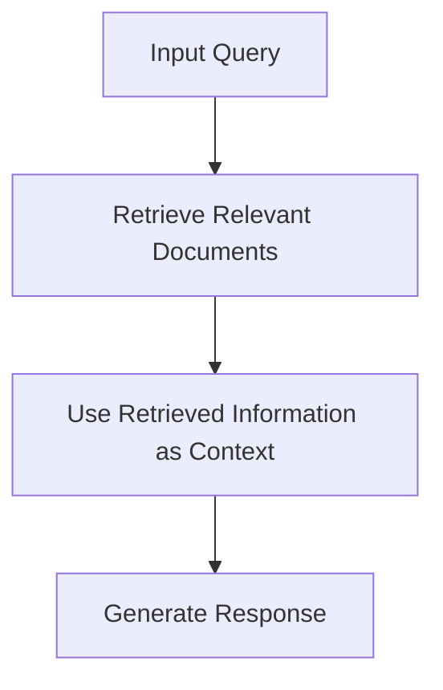

# Retrieval-Augmented Generation (RAG) Documentation

## Table of Contents
- [Introduction](#introduction)
- [What is RAG?](#what-is-rag)
- [Why Use RAG?](#why-use-rag)
- [How RAG Works](#how-rag-works)
- [Mermaid Diagram](#mermaid-diagram)
- [Implementing RAG](#implementing-rag)
  - [Using OpenAI](#using-openai)
  - [Using Hugging Face Transformers](#using-hugging-face-transformers)
- [Examples](#examples)
  - [Example with OpenAI](#example-with-openai)
  - [Example with Hugging Face Transformers](#example-with-hugging-face-transformers)
- [Best Practices](#best-practices)
- [Resources](#resources)
- [Contributing](#contributing)
- [License](#license)

## Introduction
Retrieval-Augmented Generation (RAG) is a technique that combines the strengths of retrieval-based and generation-based models. It enhances the generation process by retrieving relevant documents or information to provide contextually accurate and informative responses.

## What is RAG?
RAG leverages a retrieval mechanism to fetch relevant documents or passages from a large corpus and then uses a generation model to produce a coherent and contextually relevant response based on the retrieved information.

## Why Use RAG?
- **Improved Accuracy**: Provides more accurate and contextually relevant responses by leveraging external knowledge.
- **Enhanced Context**: Retrieves relevant information to enhance the context for the generation model.
- **Versatility**: Can be applied to various tasks such as question answering, summarization, and more.

## How RAG Works
RAG works by first retrieving relevant documents or passages from a large corpus based on the input query. The retrieved information is then used as context for the generation model to produce a response.

## (RAG) Sequence Diagram
