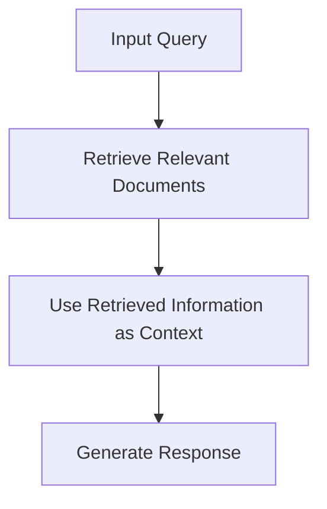

# Retrieval-Augmented Generation (RAG) Documentation

## Table of Contents
- [Introduction](#introduction)
- [What is RAG?](#what-is-rag)
- [Why Use RAG?](#why-use-rag)
- [How RAG Works](#how-rag-works)
- [Mermaid Diagram](#rag-sequence-diagram)
- [Implementing RAG](#implementing-rag)
  - [Using OpenAI](#using-openai)
  - [Using Hugging Face Transformers](#using-hugging-face-transformers)
- [Examples](#examples)
  - [Example with OpenAI](#example-with-openai)
  - [Example with Hugging Face Transformers](#example-with-hugging-face-transformers)
- [Best Practices](#best-practices)

## Introduction
Retrieval-Augmented Generation (RAG) is a technique that combines the strengths of retrieval-based and generation-based models. It enhances the generation process by retrieving relevant documents or information to provide contextually accurate and informative responses.

## What is RAG?
RAG leverages a retrieval mechanism to fetch relevant documents or passages from a large corpus and then uses a generation model to produce a coherent and contextually relevant response based on the retrieved information.

## Why Use RAG?
- **Improved Accuracy**: Provides more accurate and contextually relevant responses by leveraging external knowledge.
- **Enhanced Context**: Retrieves relevant information to enhance the context for the generation model.
- **Versatility**: Can be applied to various tasks such as question answering, summarization, and more.

## How RAG Works
RAG works by first retrieving relevant documents or passages from a large corpus based on the input query. The retrieved information is then used as context for the generation model to produce a response.

## (RAG) Sequence Diagram


## Implementing RAG

### Using OpenAI
To implement RAG with OpenAI, you need to define the retrieval mechanism and then use the generation model to produce responses based on the retrieved information.

```javascript
const { OpenAI } = require('openai');
const axios = require('axios');

const openai = new OpenAI({
    apiKey: process.env.OPENAI_API_KEY
});

async function retrieveDocuments(query) {
    // Implement your retrieval logic here
    const response = await axios.get(`https://api.example.com/search?q=${query}`);
    return response.data.documents;
}

async function generateResponse(query) {
    const documents = await retrieveDocuments(query);
    const context = documents.join(' ');

    const completion = await openai.chat.completions.create({
        model: 'gpt-3.5-turbo',
        messages: [
            { role: 'system', content: 'Use the following context to answer the query.' },
            { role: 'user', content: `Context: ${context}` },
            { role: 'user', content: query }
        ]
    });

    return completion.choices[0].message.content;
}
```

## Using Hugging Face Transformers

Hugging Face Transformers can also be used to implement RAG. You can define the retrieval mechanism and use the generation model to produce responses based on the retrieved information.

```python
from transformers import pipeline
import requests

retriever = pipeline('retrieval', model='facebook/dpr-ctx_encoder-single-nq-base')
generator = pipeline('text-generation', model='gpt-3.5-turbo')

def retrieve_documents(query):
    # Implement your retrieval logic here
    response = requests.get(f'https://api.example.com/search?q={query}')
    return response.json()['documents']

def generate_response(query):
    documents = retrieve_documents(query)
    context = ' '.join(documents)

    result = generator(f'Context: {context} Query: {query}', max_length=200)
    return result[0]['generated_text']
```

## Best Practices

- Security: Ensure that the retrieval mechanism is secure and does not expose sensitive information.
- Efficiency: Optimize the retrieval process to minimize latency.
- Testing: Thoroughly test the retrieval and generation components to ensure they work as expected.
